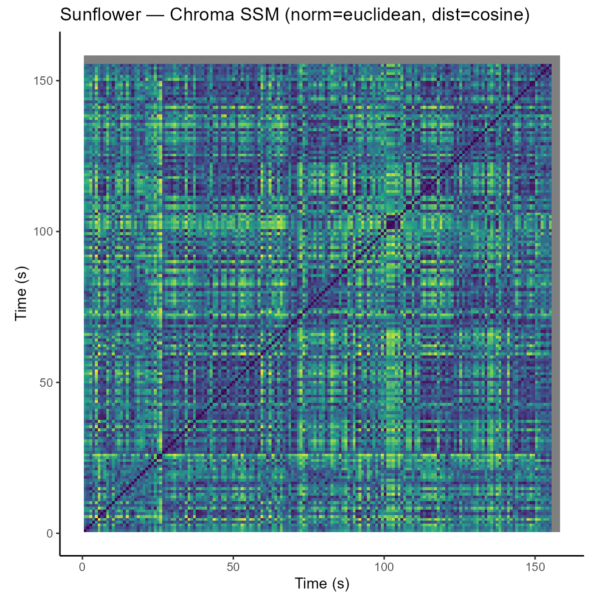

README COMPUTATIONAL MUSICOLOGY

# Week 9 – Structure Analysis
Track: Sunflower – Post Malone

## Chroma-based Self-Similarity Matrix
Normalisation: Euclidean  
Distance: Cosine  

### Interpretation

The chroma-based self-similarity matrix reveals repeating harmonic sections in the track. Clear block-like structures appear along the diagonal, indicating consistent harmonic content within sections. Off-diagonal similarities suggest that certain sections return later in the song, likely corresponding to repeated verses and choruses.

Harmonically, the song appears relatively stable and repetitive, which aligns with what is heard: a consistent chord progression supporting the vocal melody throughout the track. The structure is therefore clearly visible in the chroma representation.