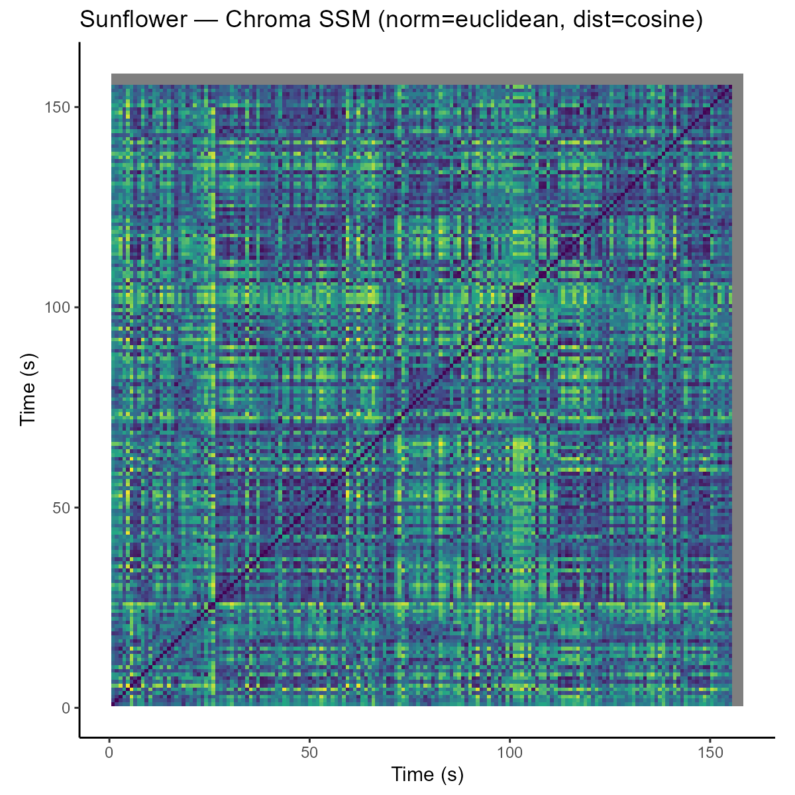

README COMPUTATIONAL MUSICOLOGY

# Week 9 – Structure Analysis
Track: Sunflower – Post Malone

## Chroma-based Self-Similarity Matrix
Normalisation: Euclidean  
Distance: Cosine  

### Interpretation

The chroma-based self-similarity matrix (Euclidean normalisation, cosine distance) shows several repeating blocks along the diagonal. These blocks indicate sections where the harmonic content remains similar over time.

There are also visible off-diagonal similarities, which suggest that certain sections return later in the track. This likely corresponds to the repetition of verses and choruses. When listening to the song, the harmony remains relatively stable and repetitive, and this is reflected clearly in the matrix.
