## Row

# Corpus

::: card
### Introduction

This project examines the musical evolution of The Weeknd by comparing two phases of his career that can both be understood as trilogies. His early work—House of Balloons, Thursday, and Echoes of Silence—was later compiled into the album Trilogy, forming a clearly defined body of work that established his initial sound and themes.   

In contrast, his more recent albums—After Hours, Dawn FM, and Hurry Up Tomorrow—have been described by the artist as forming a new, more conceptual trilogy. Rather than a formal compilation, this later sequence can be interpreted as a “spiritual trilogy,” centered on the transformation of his artistic persona. This parallel makes his discography a compelling case for examining stylistic development across two deliberately framed phases.   

To explore this, the project applies computational audio features—chroma (harmony), MFCC (timbre), novelty curves (structure), and tempograms (rhythm)—to identify measurable differences between these periods. In addition, three representative tracks are analysed in detail: “Wicked Games” and “Blinding Lights”. These are the most streamed tracks of their respective trilogies. Due to personal bias, “After Hours” is also included alongside these two tracks. In my view, this is the most interesting piece of music he has released across both trilogies.   

To what extent do computational audio features reveal a stylistic evolution in The Weeknd’s music between his early Trilogy and his later conceptual trilogy?
:::

# Moods
::: card

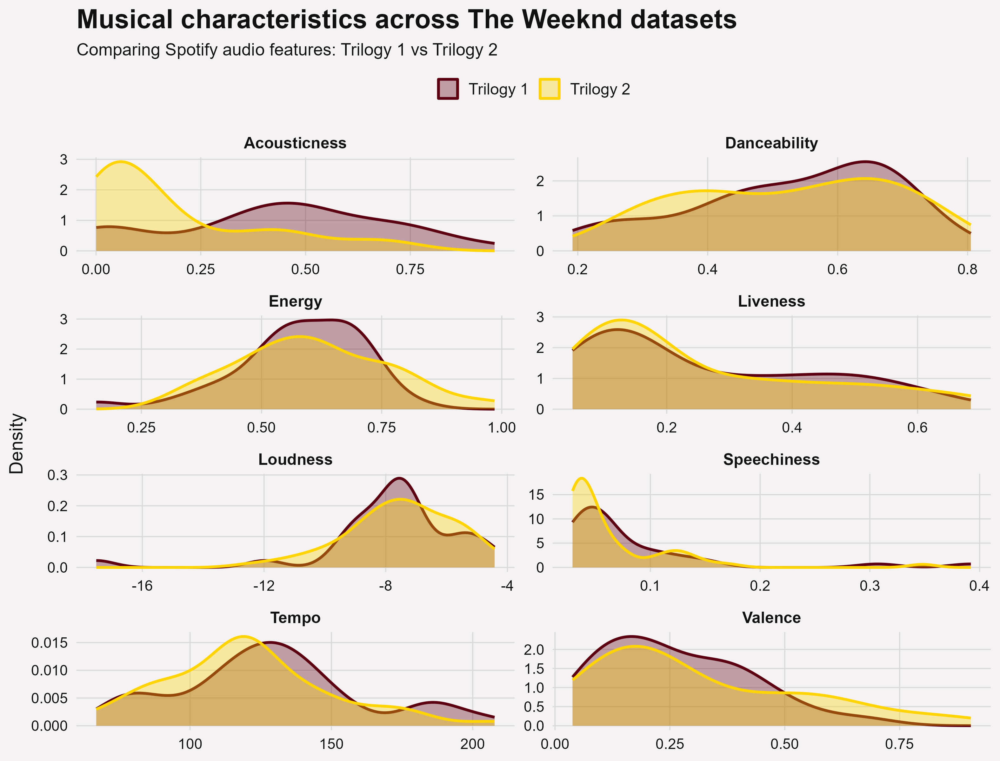
:::
::: card
**Acousticness**  
Trilogy 2 (yellow) starts with higher values, indicating more acoustic elements in some tracks, but it quickly declines. Trilogy 1 (red) is more centered around mid-values, suggesting a more consistent but less acoustic overall sound.

**Danceability**  
Both datasets are quite similar, but Trilogy 1 shows a slightly higher peak around 0.6–0.7. This suggests that its tracks may be a bit more danceable, while Trilogy 2 is more evenly spread.

**Energy**  
Trilogy 1 has a strong peak at medium-high energy levels, whereas Trilogy 2 is more widely distributed. This indicates that Trilogy 2 includes both calmer and more energetic tracks, showing greater variation.

**Liveness**  
Both distributions are very similar and concentrated at low values. This suggests that most tracks in both trilogies are studio recordings with little live performance influence.

**Loudness**  
The patterns are comparable, but Trilogy 1 has a sharper peak around -8 dB, indicating more consistency in loudness. Trilogy 2 is more spread out, suggesting slightly more variation in production levels.

**Speechiness**  
Both trilogies have low speechiness overall, as expected for music. However, Trilogy 1 shows a few higher-value outliers, which may indicate occasional spoken segments or intros.

**Tempo**  
Trilogy 2 peaks slightly lower (around 110 BPM), while Trilogy 1 peaks higher (around 120–130 BPM). Trilogy 1 also shows a small secondary peak at higher tempos, suggesting more diversity.

**Valence**  
Trilogy 1 generally has higher valence values, meaning it leans slightly more toward positive or upbeat moods. Trilogy 2 shows more lower values, indicating a darker or more melancholic tone.

**Conclusion**  
Overall, Trilogy 1 appears more consistent and slightly more energetic, danceable, and positive. In contrast, Trilogy 2 shows greater variation across several features and leans more toward a darker, more diverse sound profile.
:::

## Row
# Chromagrams
::: card

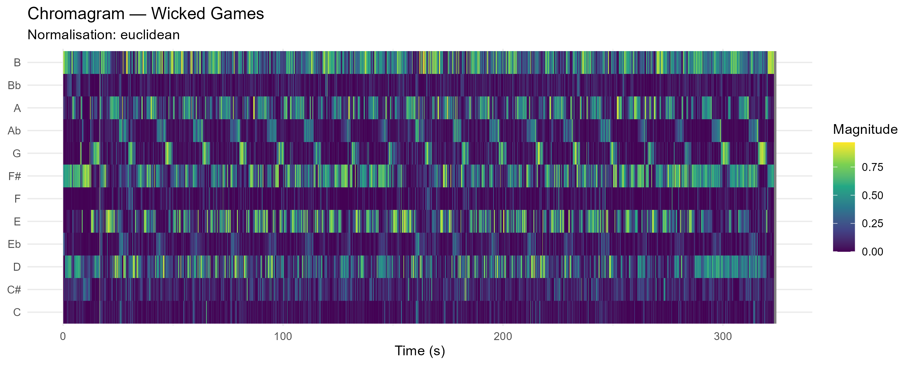{width=100%}

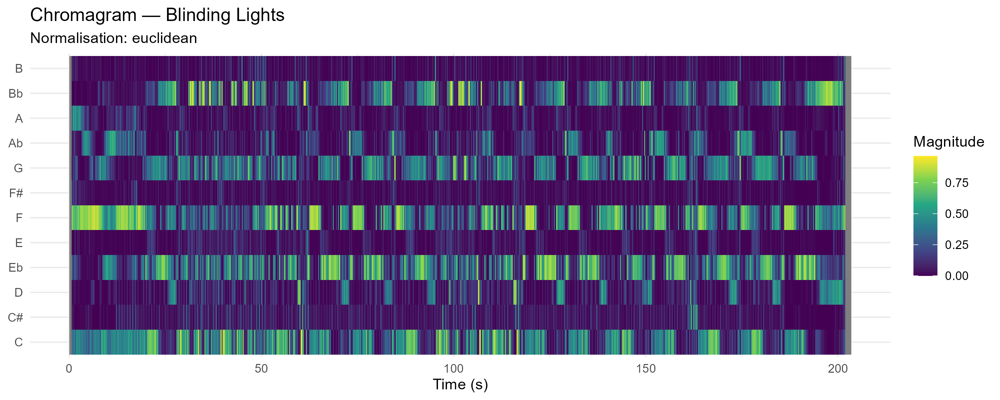{width=100%}

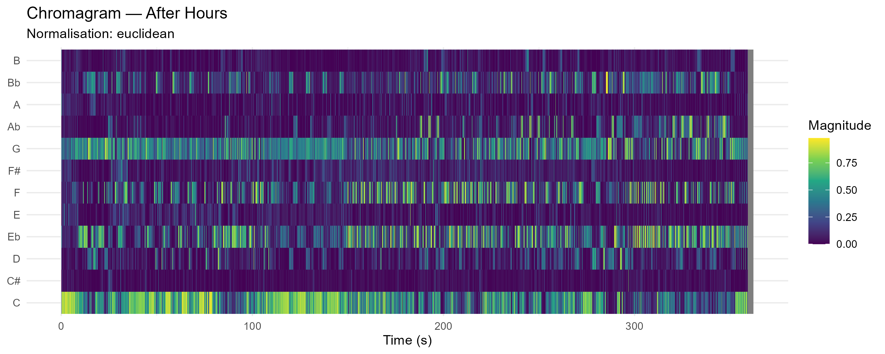{width=100%}
:::

:::card
### Analysis
Chroma-based features (chromagrams) provide a mid-level representation of audio by mapping spectral energy onto twelve pitch classes. This involves substantial dimensionality reduction through octave collapse, where pitches separated by octaves are aggregated. Euclidean normalization emphasizes relative pitch content over dynamics. However, this transformation is inherently lossy: information about register, voicing, and the distinction between fundamentals and harmonics is suppressed, requiring cautious interpretation.  

Across the three tracks, clear differences emerge in spectral density, harmonic stability, and chroma segmentation.

**Wicked Games** represents the highest degree of harmonic homogeneity. The chromagram consists of near-identical repeating patterns dominated by B, A, G, and E, indicating a stable loop-based structure. This strong visual regularity suggests minimal harmonic variation over time. However, this consistency likely reflects structural repetition rather than nuanced harmonic development, and the chromagram remains insensitive to expressive or timbral changes.  

**Blinding Lights** shows clearer chroma segmentation. Energy is concentrated in discrete vertical blocks, primarily around F, Bb, Eb, and C. This indicates a stable and repetitive chord progression with well-defined transitions. The sharpness of these segments is consistent with a cleaner spectral profile, likely associated with synthesized timbres. Compared to “Wicked Games,” this track exhibits more explicit chord changes, while still maintaining high harmonic stability.

**After Hours** exhibits the highest spectral density. A persistent energy concentration in the C bin suggests a tonal center, but significant activity across G, F, and Eb complicates interpretation. This apparent complexity may reflect either genuine harmonic richness or spectral leakage from overtones. For example, energy in the G bin could indicate a dominant pitch, but may also arise from the third harmonic of C. As a result, chord inference becomes ambiguous, highlighting the limitations of chromagrams in dense spectral contexts.  

Overall, the three tracks form a continuum: from high repetition and stability (**Wicked Games**), to clearly segmented harmonic structure (**Blinding Lights**), to high spectral density and interpretive ambiguity (**After Hours**). These results demonstrate that chromagrams are most reliable in contexts with clear harmonic segmentation and low spectral interference, but become increasingly ambiguous as spectral complexity increases.

:::
## Row

# Cepstograms

::: card

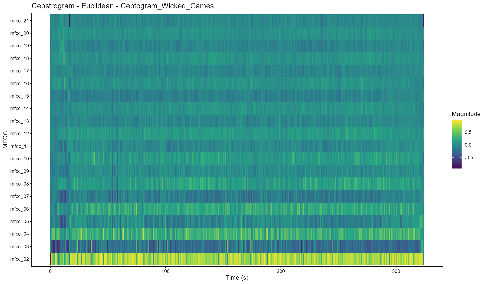

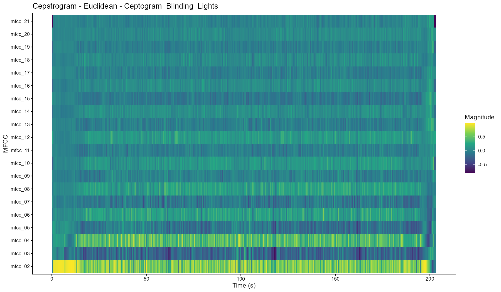
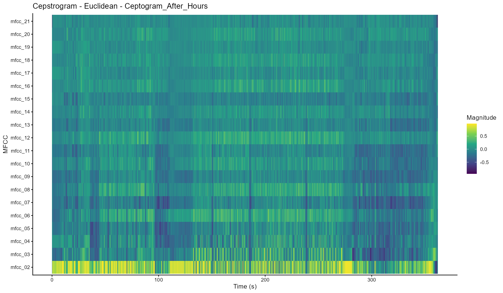
:::

::: card
### Analysis
The Mel-frequency cepstrum (MFCC), often shown as a ceptogram, is a way to represent audio by capturing the overall shape of the spectrum, which relates closely to timbre (or “sound color”). Unlike chromagrams, which focus on pitch and harmony, ceptograms focus more on how something sounds, for example the type of instrument or texture, using the perceptually based Mel scale.  

Looking at the three tracks, clear differences appear in how stable or dense their timbre is. **Wicked Games** shows the most stable timbral pattern. Its ceptogram is very repetitive and changes little over time, which reflects the minimal arrangement built around consistent elements like electric guitar and vocals. This results in a very uniform sound throughout the track.  

**Blinding Lights** shows more structure over time. Its ceptogram has clear vertical lines that line up with percussive hits, while the overall spectral shape stays relatively stable in between. This suggests a clean and controlled sound, where changes in timbre are organized and easy to follow, matching the steady, rhythmic feel of the track.  

**After Hours** shows the most variation. The ceptogram has a lot of fluctuation across both lower and higher coefficients, indicating a dense mix of sounds. This reflects the layered production with synthesizers and processed vocals. Because so many elements are present at once, it becomes harder to separate individual sound sources, as the timbral information is spread out across the whole representation.  

Even though ceptograms are useful, they are still simplified representations. They highlight timbre, but lose detailed harmonic information, and can sometimes reflect production choices rather than actual musical structure. Because of this, they should be seen as models of the audio signal, not as a direct representation of how we hear or interpret the music.  

:::
## Row
# Novelty Curves

::: card

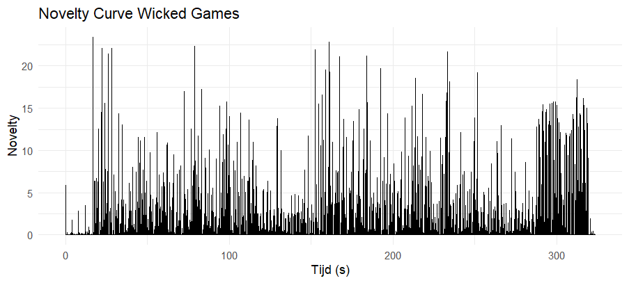{width=100%}
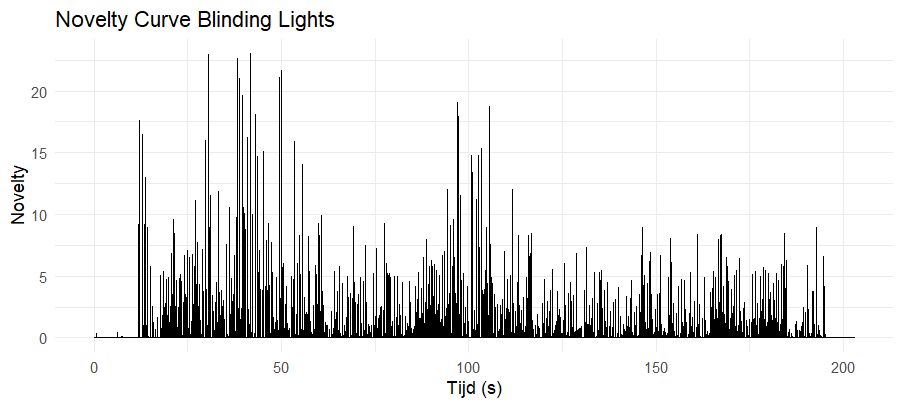{width=100%}

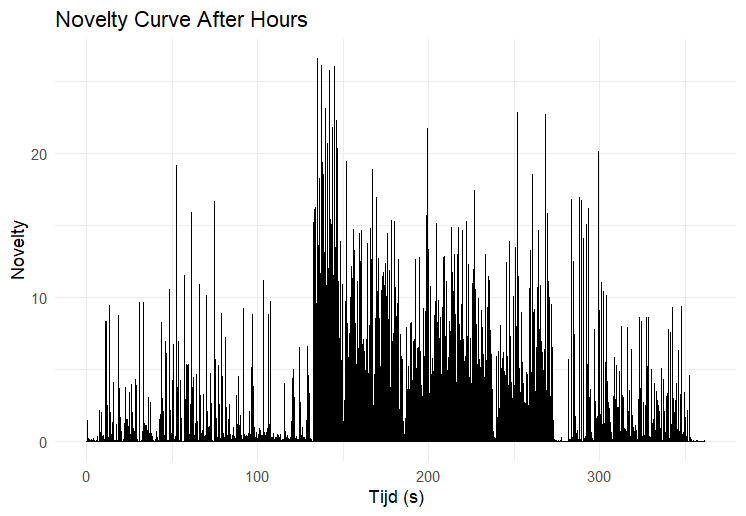{width=100%}

:::

::: card
### Analysis
Novelty functions measure how much an audio signal changes over time and are often used to detect structural boundaries or transitions in music. They highlight moments where something new happens, but it is important to note that they capture signal changes rather than how listeners actually perceive musical structure.   

Looking at the three tracks, clear differences appear in how change is distributed. **Wicked Games** shows a relatively stable novelty pattern with repeating clusters of peaks, reflecting its loop-based structure with small variations within a consistent framework. **Blinding Lights** has a more regular and predictable pattern, with evenly spaced peaks that mirror its steady rhythm and repetitive drum pattern, making the temporal structure easy to follow. **After Hours**, in contrast, shows more variation, including a dense cluster of larger peaks that likely corresponds to a moment of rapid change or buildup. This being around the 2-minute mark makes sense, because this is the moment the bass comes in for the first time.      

Overall, the three tracks form a spectrum, from stable, loop-based variation in **Wicked Games**, to steady, rhythmically structured change in **Blinding Lights**, to more concentrated and large-scale change in **After Hours**. 

:::

## Row
# Tempograms
::: card 

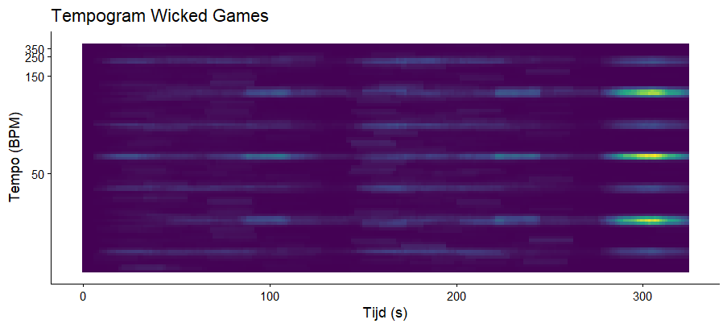{width=100%}

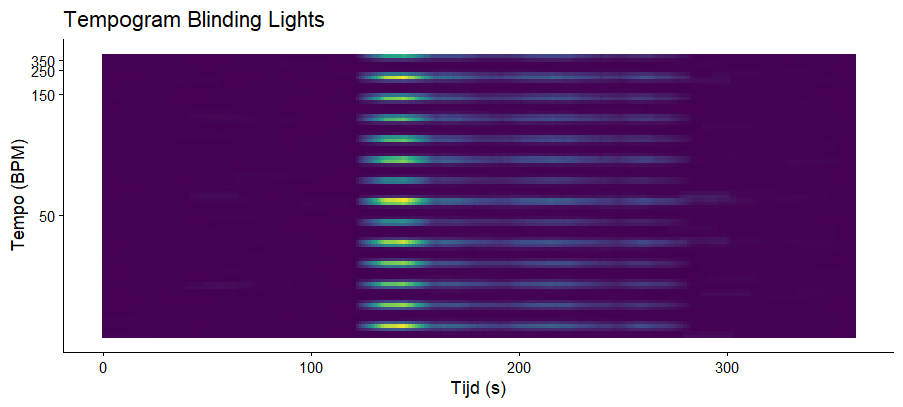{width=100%}

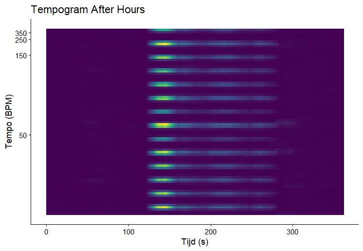{width=100%}
:::

::: card
### Analysis   
Tempograms represent tempo-related periodicities over time by analyzing the regularity of events derived from a novelty curve. The novelty curve acts as an event-density signal, capturing the temporal distribution of onsets and transient changes, while the tempogram reveals how these events are periodically organized. Regular sequences of onsets produce stable horizontal bands, whereas irregular or sparse activity results in weaker or more diffuse representations.   

Clear differences emerge across the three tracks in terms of rhythmic stability and temporal organization. **Wicked Games** shows a present but intermittent pulse: its tempogram appears in clustered segments rather than as a continuous band. This reflects its loop-based structure, where rhythmic activity is grouped into repeating units with relatively sparse transitions, resulting in a tempo that is locally reinforced but not consistently sustained over time.   

**Blinding Lights** exhibits the highest degree of rhythmic stability. Its tempogram contains strong, continuous horizontal bands, indicating a highly regular sequence of onsets and a persistent, clearly articulated pulse. The presence of multiple parallel bands suggests a hierarchical rhythmic structure, capturing both the primary beat and its subdivisions, which is characteristic of tightly quantized, percussively driven music.   
**After Hours** shows the greatest variability. A dense cluster of horizontal bands appears within a limited time window, indicating a segment of strong rhythmic activity and clearly defined periodicity. Outside of this region, the tempogram becomes sparse and less structured, suggesting weaker or less consistent onset patterns. This contrast points to larger-scale structural changes in the track, where tempo clarity emerges only during specific sections.   

Overall, the three tracks illustrate a continuum from locally reinforced but intermittent periodicity (**Wicked Games**), to highly stable and continuously articulated rhythm (**Blinding Lights**), to temporally concentrated rhythmic activity (**After Hours**). While tempograms provide a structured view of temporal regularity, their interpretation remains dependent on the quality of the novelty curve and on distinguishing between computational periodicities and perceptually relevant tempo levels.
::: 

## Row

# Dendogram
::: card

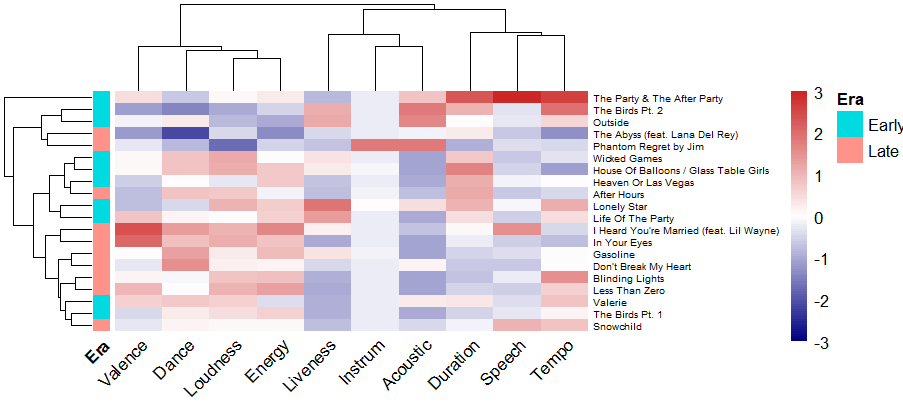

:::

::: card
### Analysis

The clustering reveals both continuity and change in The Weeknd’s musical style. Some early and late tracks (e.g., **Wicked Games** and **After Hours**) are positioned close together, suggesting a persistent preference for darker, mid-tempo, low-valence soundscapes.   

The most notable difference appears in the late era, where tracks such as **Blinding Lights** and **In Your Eyes** cluster strongly around high Energy, Loudness, and Danceability. This indicates a clear shift toward a more polished, synth-pop-oriented sound.   

In contrast, the early era shows greater variation in Acousticness and Instrumentalness, pointing to a less uniform and more experimental production style.   

These observations suggest that The Weeknd’s musical evolution is not a complete stylistic break, but rather a gradual refinement of an existing aesthetic. While newer tracks introduce higher energy and more dance-oriented elements, they still retain core characteristics present in earlier work. As a result, the clustering reflects a balance between consistency and innovation, where familiar sonic traits persist even as production becomes more polished and commercially oriented.   
  
However, these results should be interpreted with caution, as Spotify audio features provide only a simplified representation of musical characteristics.

:::

## Row
# Conclusion
::: card

### Conclusion

This project set out to examine how The Weeknd’s music has evolved over time by comparing his early *Trilogy* material with his later albums, using both corpus-level features and detailed analyses of representative tracks such as “Wicked Games,” “Blinding Lights,” and “After Hours.”   

Overall, the results indicate that computational audio features provide consistent, though not complete, evidence for a stylistic evolution in The Weeknd’s music between his early and later trilogies. Across multiple levels of analysis, a clear shift emerges from relatively uniform, loop-based musical structures toward more varied, segmented, and structurally complex productions.   

Importantly, this evolution does not represent a complete stylistic break, as similarities between early and later tracks persist, reflecting a continuity in The Weeknd’s core aesthetic.   

Early work, as exemplified by “Wicked Games,” is characterized by high harmonic stability, repetitive structures, and limited variation in timbre and temporal organization. These qualities are reflected in stable chroma patterns, consistent cepstral representations, and clustered novelty peaks, suggesting gradual and incremental change over time.   

In contrast, later tracks such as “Blinding Lights” and “After Hours” demonstrate increased segmentation, clearer structural boundaries, and greater rhythmic regularity. Novelty curves reveal more evenly distributed and interpretable structural changes, while tempograms show stronger and more continuous periodicities, indicating a more clearly defined rhythmic framework. At the same time, MFCC-based representations point to a denser and more layered timbral profile, reflecting more complex production techniques.   

At the corpus level, this evolution is further supported by broader distributions in features such as energy, tempo, and acousticness in the later trilogy, suggesting increased stylistic diversity. Clustering results reinforce this trend, showing that newer tracks are less tightly grouped and exhibit greater variation in their feature profiles compared to earlier work.   

However, these findings should be interpreted with caution. While computational features are effective in capturing patterns related to harmony, timbre, and rhythm, they remain simplified representations of complex musical phenomena. As a result, they cannot fully account for perceptual, expressive, or contextual aspects of musical meaning, and may sometimes reflect production characteristics rather than structural properties.   

Overall, the analysis demonstrates that computational audio features can meaningfully capture large-scale stylistic trends in The Weeknd’s music, particularly in terms of increased complexity, segmentation, and production richness. At the same time, their limitations highlight the importance of combining quantitative analysis with critical musical interpretation when studying artistic evolution.

:::