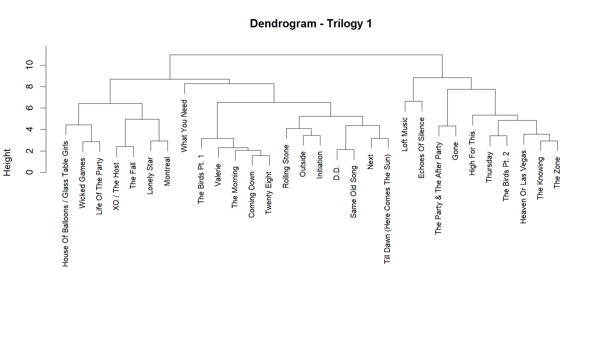
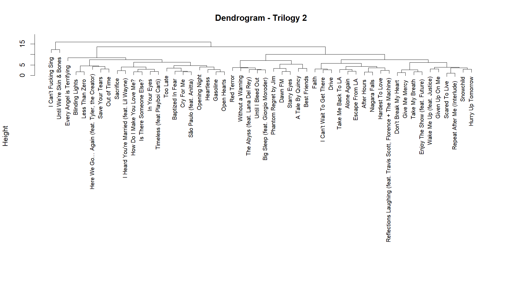

## Row

# Corpus

::: card
### Corpus

In this project, I explore how The Weeknd’s music has evolved over time. As a corpus, I compare his first three mixtapes—later compiled as *Trilogy*—with his latest three albums: *After Hours*, *Dawn FM*, and *Hurry Up Tomorrow*.

The Weeknd himself has suggested that these recent projects form a new trilogy. Shortly after the release of *Dawn FM* in 2022, he tweeted that listeners might be “experiencing a new trilogy.” In interviews, he has also described these records as part of a broader transformation of his artistic persona.

Because of these themes, the albums are often interpreted as a conceptual or spiritual trilogy. Comparing The Weeknd’s first trilogy with his most recent one therefore offers an interesting way to examine how his voice, themes, and emotional tone have evolved over time.
:::

# Moods
::: card

:::
::: card
**Acousticness**  
Trilogy 2 (yellow) starts with higher values, indicating more acoustic elements in some tracks, but it quickly declines. Trilogy 1 (red) is more centered around mid-values, suggesting a more consistent but less acoustic overall sound.

**Danceability**  
Both datasets are quite similar, but Trilogy 1 shows a slightly higher peak around 0.6–0.7. This suggests that its tracks may be a bit more danceable, while Trilogy 2 is more evenly spread.

**Energy**  
Trilogy 1 has a strong peak at medium-high energy levels, whereas Trilogy 2 is more widely distributed. This indicates that Trilogy 2 includes both calmer and more energetic tracks, showing greater variation.

**Liveness**  
Both distributions are very similar and concentrated at low values. This suggests that most tracks in both trilogies are studio recordings with little live performance influence.

**Loudness**  
The patterns are comparable, but Trilogy 1 has a sharper peak around -8 dB, indicating more consistency in loudness. Trilogy 2 is more spread out, suggesting slightly more variation in production levels.

**Speechiness**  
Both trilogies have low speechiness overall, as expected for music. However, Trilogy 1 shows a few higher-value outliers, which may indicate occasional spoken segments or intros.

**Tempo**  
Trilogy 2 peaks slightly lower (around 110 BPM), while Trilogy 1 peaks higher (around 120–130 BPM). Trilogy 1 also shows a small secondary peak at higher tempos, suggesting more diversity.

**Valence**  
Trilogy 1 generally has higher valence values, meaning it leans slightly more toward positive or upbeat moods. Trilogy 2 shows more lower values, indicating a darker or more melancholic tone.

**Conclusion**  
Overall, Trilogy 1 appears more consistent and slightly more energetic, danceable, and positive. In contrast, Trilogy 2 shows greater variation across several features and leans more toward a darker, more diverse sound profile.
:::

## Row
# Chromagrams
::: card

{width=100%}

{width=100%}

{width=100%}
:::

:::card
Chroma-based features (chromagrams) provide a mid-level representation of audio by mapping spectral energy onto twelve pitch classes. This involves substantial dimensionality reduction through octave collapse, where pitches separated by octaves are aggregated. Euclidean normalization emphasizes relative pitch content over dynamics. However, this transformation is inherently lossy: information about register, voicing, and the distinction between fundamentals and harmonics is suppressed, requiring cautious interpretation.  

Across the three tracks, clear differences emerge in spectral density, harmonic stability, and chroma segmentation.

**Wicked Games** represents the highest degree of harmonic homogeneity. The chromagram consists of near-identical repeating patterns dominated by B, A, G, and E, indicating a stable loop-based structure. This strong visual regularity suggests minimal harmonic variation over time. However, this consistency likely reflects structural repetition rather than nuanced harmonic development, and the chromagram remains insensitive to expressive or timbral changes.  

**Blinding Lights** shows clearer chroma segmentation. Energy is concentrated in discrete vertical blocks, primarily around F, Bb, Eb, and C. This indicates a stable and repetitive chord progression with well-defined transitions. The sharpness of these segments is consistent with a cleaner spectral profile, likely associated with synthesized timbres. Compared to “Wicked Games,” this track exhibits more explicit chord changes, while still maintaining high harmonic stability.

**After Hours** exhibits the highest spectral density. A persistent energy concentration in the C bin suggests a tonal center, but significant activity across G, F, and Eb complicates interpretation. This apparent complexity may reflect either genuine harmonic richness or spectral leakage from overtones. For example, energy in the G bin could indicate a dominant pitch, but may also arise from the third harmonic of C. As a result, chord inference becomes ambiguous, highlighting the limitations of chromagrams in dense spectral contexts.  

Overall, the three tracks form a continuum: from high repetition and stability (**Wicked Games**), to clearly segmented harmonic structure (**Blinding Lights**), to high spectral density and interpretive ambiguity (**After Hours**). These results demonstrate that chromagrams are most reliable in contexts with clear harmonic segmentation and low spectral interference, but become increasingly ambiguous as spectral complexity increases.

:::
## Row

# Cepstograms

::: card
### The Weeknd cepstogram

:::

::: card
The Mel-frequency cepstrum (MFCC), often shown as a ceptogram, is a way to represent audio by capturing the overall shape of the spectrum, which relates closely to timbre (or “sound color”). Unlike chromagrams, which focus on pitch and harmony, ceptograms focus more on how something sounds, for example the type of instrument or texture, using the perceptually based Mel scale.  

Looking at the three tracks, clear differences appear in how stable or dense their timbre is. Wicked Games shows the most stable timbral pattern. Its ceptogram is very repetitive and changes little over time, which reflects the minimal arrangement built around consistent elements like electric guitar and vocals. This results in a very uniform sound throughout the track.  

Blinding Lights shows more structure over time. Its ceptogram has clear vertical lines that line up with percussive hits, while the overall spectral shape stays relatively stable in between. This suggests a clean and controlled sound, where changes in timbre are organized and easy to follow, matching the steady, rhythmic feel of the track.  

After Hours shows the most variation. The ceptogram has a lot of fluctuation across both lower and higher coefficients, indicating a dense mix of sounds. This reflects the layered production with synthesizers and processed vocals. Because so many elements are present at once, it becomes harder to separate individual sound sources, as the timbral information is spread out across the whole representation.  

Even though ceptograms are useful, they are still simplified representations. They highlight timbre, but lose detailed harmonic information, and can sometimes reflect production choices rather than actual musical structure. Because of this, they should be seen as models of the audio signal, not as a direct representation of how we hear or interpret the music.  

:::
## Row
# Novelty Curves

::: card
### After Hours Novelty Curve
{width=100%}
{width=100%}

{width=100%}

:::

::: card
### Analysis
Novelty functions measure how much an audio signal changes over time and are often used to detect structural boundaries or transitions in music. They do this by tracking local changes in features like spectrum, energy, or phase. In that sense, they act as a computational way of spotting moments where something new happens in the music. However, it’s important to remember that these curves represent changes in the signal itself, not necessarily how a listener actually perceives musical structure.  

Looking at the three tracks, clear differences appear in how change is distributed over time. “Wicked Games” shows a fairly stable novelty pattern, with repeating clusters of peaks. This fits its loop-based structure, where small variations happen within an otherwise consistent harmonic and timbral framework. As a result, the novelty curve reflects ongoing small changes rather than major structural shifts.  

“Blinding Lights” shows a much more regular pattern. The peaks are evenly spaced and have similar strength, which matches the track’s steady rhythm and repetitive drum pattern. Because of this consistency, it becomes easier to detect onsets and rhythmic subdivisions, making the overall temporal structure very clear.  

“After Hours,” on the other hand, shows much more variation. There is a dense cluster of large peaks, indicating a period where the music changes rapidly. This likely corresponds to a major transition or build-up in the track. Compared to the other songs, where changes are more evenly spread out, this section stands out as a moment of intense activity, which can also make smaller changes harder to detect.

How we interpret these curves depends a lot on how they are computed. For example, the size of the analysis window (kernel) has a big influence: smaller windows capture quick, local events like note onsets, while larger ones smooth things out and highlight bigger structural sections. This means that the same track can look quite different depending on the chosen time scale.  

It’s also important to remember that novelty functions depend on the features they are built from. If they are based on chroma or MFCC features, they can reflect things like octave collapse, timbral overlap, or production artifacts instead of actual musical changes. This can result in peaks that don’t match what a listener would hear as a structural boundary.  

Overall, the three tracks form a clear spectrum: from stable, loop-based variation in “Wicked Games,” to steady and rhythmically structured change in “Blinding Lights,” to more concentrated and large-scale change in “After Hours.” Novelty curves are useful for highlighting moments of change, but they always need to be interpreted carefully, keeping in mind both their technical limitations and the difference between signal analysis and musical perception.

:::

## Row
# Tempograms
::: card 
### After Hours Tempogram
{width=100%}

{width=100%}

{width=100%}
:::

::: card
Tempograms represent tempo-related periodicities over time by analyzing the local regularity of events in an audio signal. Rather than operating directly on raw audio, they are typically derived from novelty curves, which encode the temporal distribution of onsets and transient changes. In this sense, the novelty curve functions as an event-density signal, while the tempogram captures the periodic structure of these events. A regular sequence of peaks in the novelty curve produces stable horizontal bands in the tempogram, whereas irregular or sparse activity results in weak or diffuse tempo representations.  

Clear differences emerge across the three tracks in terms of rhythmic stability and temporal organization. “Wicked Games” shows a more intermittent and clustered tempogram profile. While a dominant pulse is present, it appears in bursts rather than as a continuous band. This reflects its loop-based structure, where rhythmic activity is grouped into repeating units with relatively sparse transitions between them. The resulting pattern suggests a stable tempo that is locally reinforced but not continuously articulated.  

“Blinding Lights” exhibits the highest degree of rhythmic stability. Its tempogram shows strong, continuous horizontal bands, indicating a highly regular sequence of onsets. This reflects a tightly quantized rhythmic structure with a persistent pulse, likely driven by consistent percussive elements. The presence of multiple parallel bands indicates that the system captures both the primary beat level and its subdivisions, forming a clear hierarchical representation of tempo.  
 
“After Hours” displays the greatest variability. A dense cluster of horizontal bands appears within a limited time window, indicating a period of strong rhythmic activity and clearly defined periodicity. Outside of this region, the tempogram is relatively sparse, suggesting weaker or less consistent onset patterns. This contrast indicates that large-scale structural changes dominate the rhythmic profile, with tempo becoming more clearly defined only during sections of increased activity.  

The interpretation of these patterns depends strongly on the underlying novelty representation. Errors or ambiguities in onset detection directly affect the resulting tempogram, as irregular or noisy novelty curves lead to unstable tempo estimates. Additionally, multiple tempo bands may reflect different metrical levels rather than distinct tempos, introducing ambiguity in identifying the perceptually dominant pulse.  

Overall, the three tracks illustrate a continuum from locally reinforced but intermittent periodicity (“Wicked Games”), to highly stable and continuously articulated rhythm (“Blinding Lights”), to temporally concentrated rhythmic activity (“After Hours”). Tempograms provide a structured view of temporal regularity, but their interpretability depends on the quality of the novelty signal and the distinction between computational periodicity and perceived musical tempo.
::: 

## Row

# Dendogram
::: card
### Chroma Dendogram 1

{width=100%}

:::

::: card
### Analysis

The dendrogram for Trilogy 1 shows several clearly defined clusters, indicating strong variation between tracks. Songs group together based on similarities in their audio features, forming distinct sub-clusters that likely reflect differences in mood, structure, and production style.

In contrast, the dendrogram for Trilogy 2 appears more compact and less clearly separated. Many tracks cluster together at lower distances, suggesting that they share more similar feature profiles. This indicates a more consistent and homogeneous sound across the album.

Overall, the comparison suggests that Trilogy 1 is more diverse and experimental, while Trilogy 2 exhibits a more uniform and polished sound.

:::

::: card
### Dendogram 2

{width=100%}

:::