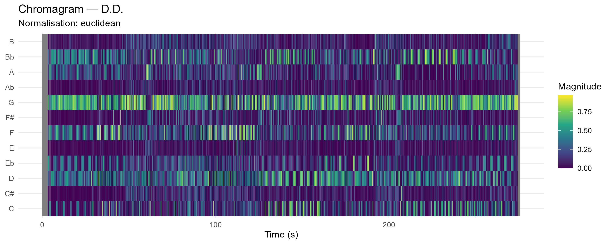
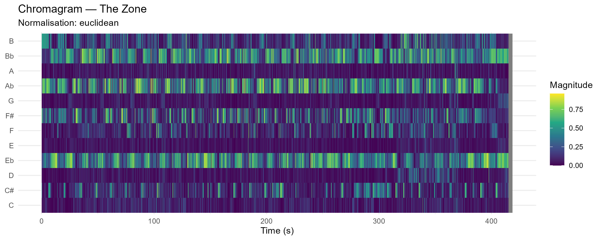
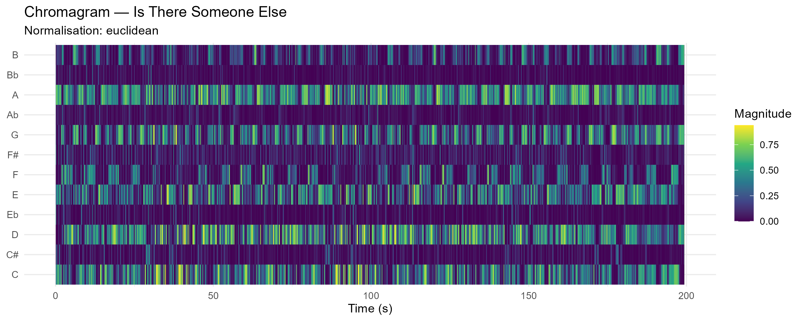
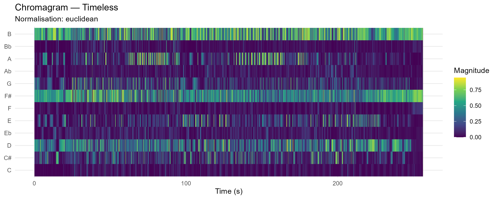

## Row

# Corpus

::: card
### Corpus

In this project, I explore how The Weeknd’s music has evolved over time. As a corpus, I compare his first three mixtapes—later compiled as *Trilogy*—with his latest three albums: *After Hours*, *Dawn FM*, and *Hurry Up Tomorrow*.

The Weeknd himself has suggested that these recent projects form a new trilogy. Shortly after the release of *Dawn FM* in 2022, he tweeted that listeners might be “experiencing a new trilogy.” In interviews, he has also described these records as part of a broader transformation of his artistic persona.

Because of these themes, the albums are often interpreted as a conceptual or spiritual trilogy. Comparing The Weeknd’s first trilogy with his most recent one therefore offers an interesting way to examine how his voice, themes, and emotional tone have evolved over time.
:::

# Moods
::: card
### Moods

:::

## Row
# Chromagrams
::: card
### D.D. / Wicked Games / The Zone (Euclidean)

{width=100%}

{width=100%}

{width=100%}
:::

::: card
### Blinding Lights / Is There Someone Else / Timeless (Euclidean)

{width=100%}

{width=100%}

{width=100%}
:::

::: card 
### After Hours (Euclidean)

{width=100%}
:::

## Row

# Cepstograms

::: card
### The Weeknd cepstogram

:::

::: card
### The Weeknd cepstogram

:::

# Tempograms

::: card
### After Hours Novelty Curve

{width=100%}

:::

::: card
### Analysis
The novelty curve visualizes how much the musical signal changes over time. Peaks in the curve represent moments where the audio features differ strongly from the previous segment, which often corresponds to rhythmic events or structural changes in the music.

In the novelty curve of After Hours, the number and intensity of peaks vary throughout the track. The first part of the song shows relatively fewer peaks, suggesting a more stable and less dense rhythmic structure. Around the middle section of the track, the novelty values increase significantly, indicating more frequent musical events and a higher level of rhythmic activity. This likely corresponds to a section where additional rhythmic or instrumental elements are introduced.

The tempogram provides insight into the tempo structure of the track by showing the strength of rhythmic periodicities at different tempo levels over time. In the tempogram of After Hours, a clear horizontal band can be observed, indicating a relatively stable tempo throughout the track. Several additional horizontal bands appear at regular intervals above and below the main tempo band. These bands represent tempo harmonics, which occur because rhythmic patterns can be perceived at multiple metrical levels.

Overall, the visualization suggests that the track maintains a consistent tempo while the rhythmic density changes over time, which is reflected in the varying intensity of the novelty curve.

:::

::: card 
### After Hours Tempogram

{width=100%}
:::

# Dendogram
::: card
### Chroma Dendogram 1

{width=100%}

:::

::: card
### Analysis

The dendrogram for Trilogy 1 shows several clearly defined clusters, indicating strong variation between tracks. Songs group together based on similarities in their audio features, forming distinct sub-clusters that likely reflect differences in mood, structure, and production style.

In contrast, the dendrogram for Trilogy 2 appears more compact and less clearly separated. Many tracks cluster together at lower distances, suggesting that they share more similar feature profiles. This indicates a more consistent and homogeneous sound across the album.

Overall, the comparison suggests that Trilogy 1 is more diverse and experimental, while Trilogy 2 exhibits a more uniform and polished sound.

:::

::: card
### Dendogram 2

{width=100%}

:::