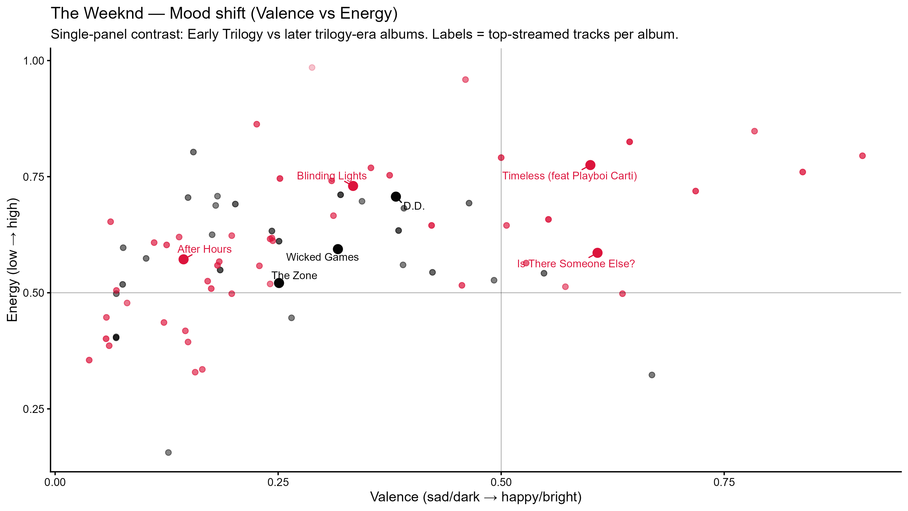

Two visual comparisons of mood and sonic identity across The Weeknd’s early and recent trilogy eras.

:::: {.columns}

::: {.column width="50%"}
::: {.scroll-panel}
### Mood shift

This scatterplot compares valence and energy across tracks from the two corpora.

{.plot-equal}

<button class="expand-btn" onclick="toggleFullscreen(this)" aria-label="Open fullscreen">
  <svg class="expand-icon" viewBox="0 0 24 24" fill="none" stroke="currentColor" stroke-width="2">
    <path d="M8 3H3v5"></path>
    <path d="M16 3h5v5"></path>
    <path d="M21 16v5h-5"></path>
    <path d="M3 16v5h5"></path>
  </svg>
</button>
:::
:::

::: {.column width="50%"}
::: {.scroll-panel}
### Audio fingerprint

This heatmap summarizes highlighted tracks using standardized audio features.

{.plot-equal}

<button class="expand-btn" onclick="toggleFullscreen(this)" aria-label="Open fullscreen">
  <svg class="expand-icon" viewBox="0 0 24 24" fill="none" stroke="currentColor" stroke-width="2">
    <path d="M8 3H3v5"></path>
    <path d="M16 3h5v5"></path>
    <path d="M21 16v5h-5"></path>
    <path d="M3 16v5h5"></path>
  </svg>
</button>
:::
:::

::::